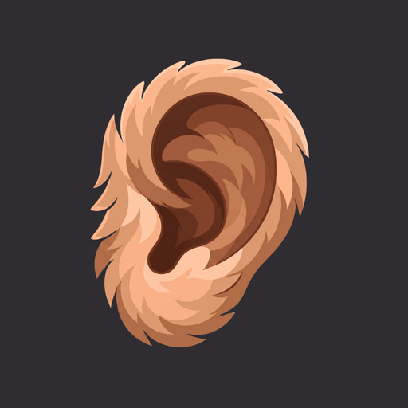

<p align="center">
  
</p>

<h1 align="center">Cheboo</h1>

<p align="center">Push-to-talk dictation powered by <a href="https://deepgram.com">Deepgram</a> Nova-3.</p>

Two apps share a single audio + transcription core:

- **macOS** — menubar-resident hotkey. Hold a key anywhere, speak, release, and the transcript is typed into whatever app has focus.
- **iOS** — tap-to-record companion. Live partials while you talk, then an editable transcript you can copy, share, or save to history.

The pipeline is the same on both: 16 kHz mono Int16 PCM → Deepgram streaming WebSocket → interim + final transcripts. On macOS the result is injected as a Unicode paste; on iOS it surfaces in the UI.

## Repository layout

```
cheboo/
├── macos/         # Menubar app (Swift / AppKit / SwiftUI)
├── ios/           # Standalone app (Swift / SwiftUI / SwiftData)
└── scripts/       # Dev utilities (e.g. relocating CoreSimulator to an external disk)
```

Each app builds independently from its own `project.yml` (XcodeGen). See:

- [`macos/README.md`](macos/README.md) — menubar app, global hotkey, text injection
- [`ios/README.md`](ios/README.md) — iOS app, Shortcuts integration, history

## Engines

Both apps ship with the Deepgram streaming engine. macOS additionally supports an **OpenAI-compatible Whisper endpoint** (e.g. `whisper.cpp`'s `server`, `faster-whisper-server`, or `api.openai.com` itself) for offline / self-hosted transcription. Selectable from Settings → Engine.

## Shared core

These files are duplicated verbatim between the two targets — keep them in sync when changing either side:

- `Audio/AudioEngine.swift` (the macOS variant adds device-loss recovery)
- `Network/DeepgramSocket.swift`, `Network/DeepgramResponse.swift`
- `Storage/Keychain.swift`
- `Resources/Keyterms.swift`

The medium-term plan is to lift these into a shared SPM package.

## Requirements

- macOS 14+ / iOS 17+
- Xcode 15+
- [XcodeGen](https://github.com/yonaskolb/XcodeGen) (`brew install xcodegen`) to generate the `.xcodeproj` files from `project.yml`
- A Deepgram API key (free tier is plenty for personal use); paste it into Settings on first run — it's stored in Keychain

## Quick start

```sh
# macOS
cd macos
xcodegen generate
open Cheboo.xcodeproj           # ⌘R to run

# iOS
cd ios
xcodegen generate
open Cheboo.xcodeproj           # ⌘R to a real device (simulator mic is flaky)
```

First launch will prompt for the necessary permissions:

- **macOS** — Microphone, Accessibility, Input Monitoring
- **iOS** — Microphone

## Hotkeys (macOS)

- **Dictate** — default ⌥Space. Push-to-talk by default; can be set to toggle in Settings.
- **Paste current buffer** — optional. Forces the in-progress transcript into the focused input without waiting for the natural endpoint.
- **Clear subtitles** — optional. Wipes the on-screen subtitle band when subtitle mode is on.

All three are rebindable in Settings → General.

## Voice commands

Spoken punctuation is recognized in both English and Russian and substituted client-side, so it works even when Deepgram's auto-punctuation is off:

| Spoken | Inserts |
|---|---|
| comma / запятая | `, ` |
| period / точка | `. ` |
| question mark / вопросительный знак | `? ` |
| exclamation mark / восклицательный знак | `! ` |
| semicolon / точка с запятой | `; ` |
| colon / двоеточие | `: ` |
| dash / тире | ` — ` |
| hyphen / дефис | `-` |
| new line / новая строка | newline |
| new paragraph / новый абзац | blank line |

## Privacy

- API key lives in the system Keychain.
- Audio is streamed to Deepgram only while you're actively dictating. Nothing is recorded to disk.
- On iOS, finished transcripts go into a local SwiftData store (toggleable in Settings).
- Cheboo does not phone home, ship telemetry, or talk to any service except the one(s) you've configured (Deepgram and/or your Whisper server).

## Status

Both apps are usable day-to-day. See each app's README for milestone breakdown and known gaps. The most visible missing pieces:

- No reconnect-on-drop yet — a network blip ends the active session.
- macOS app ships ad-hoc signed (`CODE_SIGN_IDENTITY = "-"`); notarization is deferred.
- BYO API key — there's no token-broker backend, so don't ship a build with an embedded key.

## License

TBD.
